# Patrones GoF — Documento conceptual

> Trabajo conceptual sobre los 23 patrones de diseño del *Gang of Four* (Gamma,
> Helm, Johnson, Vlissides — 1994), agrupados en tres categorías: **creacionales**,
> **estructurales** y **de comportamiento**.

## Tabla resumen de los 23 patrones

| #  | Nombre Patrón            | Tipo / Categoría    | Problema que resuelve                                                                 | Diagrama de clases (resumen)                                                       | Casos de uso                                                              | Ventajas / Desventajas                                                                                                 | Patrones relacionados                              |
|----|--------------------------|---------------------|---------------------------------------------------------------------------------------|------------------------------------------------------------------------------------|---------------------------------------------------------------------------|------------------------------------------------------------------------------------------------------------------------|----------------------------------------------------|
| 1  | **Abstract Factory**     | Creacional          | Crear familias de objetos relacionados sin acoplarse a sus clases concretas.          | `AbstractFactory` → `ConcreteFactory` → `AbstractProductA/B` → `ConcreteProduct*`. [Diagrama](#1-abstract-factory) | UI multiplataforma (Win/Mac), drivers de BD por motor.                    | ✅ Desacopla creación. ✅ Cambiar familia entera es trivial. <br> ⚠️ Difícil añadir un nuevo producto a la familia.                       | Factory Method, Singleton, Prototype                |
| 2  | **Builder**              | Creacional          | Construir objetos complejos paso a paso con muchos parámetros opcionales.             | `Director` usa `Builder` (abstract) → `ConcreteBuilder` → `Product`. [Diagrama](#2-builder) | Construir un `Estudiante`, queries SQL, JSON/HTTP requests.               | ✅ Evita constructores telescópicos. ✅ Reutiliza “recetas” via Director. <br> ⚠️ Aumenta el número de clases.                          | Abstract Factory, Composite                         |
| 3  | **Factory Method**       | Creacional          | Delegar la creación de un objeto a una subclase sin acoplar al cliente.               | `Creator.factoryMethod()` → `Product`; `ConcreteCreator` decide el `ConcreteProduct`. [Diagrama](#3-factory-method) | Frameworks que crean objetos cuya clase concreta depende del contexto.    | ✅ Cumple OCP: añadir creadores sin tocar al cliente. <br> ⚠️ Crece la jerarquía de clases.                                              | Abstract Factory, Template Method, Prototype        |
| 4  | **Prototype**            | Creacional          | Clonar objetos existentes en lugar de crearlos desde cero.                            | `Prototype.clone()` → instancia equivalente. [Diagrama](#4-prototype)              | Configuraciones pesadas, objetos con muchos campos default.               | ✅ Evita coste de construcción. ✅ Permite registry de prototipos. <br> ⚠️ Clonar objetos con referencias circulares es complejo.        | Abstract Factory, Composite                         |
| 5  | **Singleton**            | Creacional          | Garantizar una única instancia accesible globalmente.                                 | Clase con constructor privado + `getInstance()` estático. [Diagrama](#5-singleton) | Configuración global, pool de conexiones, logger.                         | ✅ Acceso global controlado. <br> ⚠️ Estado global oculto, dificulta pruebas y concurrencia.                                            | Facade, Abstract Factory                             |
| 6  | **Adapter**              | Estructural         | Hacer compatibles dos interfaces incompatibles.                                       | `Target ← Adapter → Adaptee`. [Diagrama](#6-adapter)                               | Integrar libs de terceros, migración progresiva de APIs.                   | ✅ Reutiliza código existente. <br> ⚠️ Suma una indirección y puede ocultar diseño deficiente.                                          | Bridge, Decorator, Facade                            |
| 7  | **Bridge**               | Estructural         | Separar abstracción de implementación para que evolucionen independientes.            | `Abstraction` → `Implementor` (composición), con jerarquías paralelas. [Diagrama](#7-bridge) | Drivers gráficos (forma × API render), persistencia (DAO × motor).         | ✅ Doble jerarquía sin explosión combinatoria. <br> ⚠️ Mayor complejidad inicial.                                                        | Adapter, Abstract Factory                            |
| 8  | **Composite**            | Estructural         | Tratar objetos individuales y compuestos de forma uniforme (estructura en árbol).     | `Component ← Leaf`, `Component ← Composite (children: Component*)`. [Diagrama](#8-composite) | Árboles de UI, sistemas de archivos, jerarquías de menús.                  | ✅ El cliente usa la misma API para hoja y compuesto. <br> ⚠️ Difícil restringir tipos válidos como hijos.                              | Decorator, Iterator, Visitor                         |
| 9  | **Decorator**            | Estructural         | Añadir responsabilidades a un objeto en tiempo de ejecución sin alterar su clase.     | `Component ← ConcreteComponent`, `Component ← Decorator → Component (wrappee)`. [Diagrama](#9-decorator) | Streams I/O, canales de notificación apilables, middleware HTTP.            | ✅ Composición sobre herencia. <br> ⚠️ Muchos objetos pequeños difíciles de depurar.                                                    | Composite, Strategy, Adapter                          |
| 10 | **Facade**               | Estructural         | Exponer una interfaz simple sobre un subsistema complejo.                             | `Facade` → varios `Subsystem*`. [Diagrama](#10-facade)                             | Servicios de orquestación, librerías cliente sobre APIs internas.          | ✅ Reduce acoplamiento del cliente. ✅ Punto único de entrada. <br> ⚠️ Puede volverse un *god object* si no se controla.                 | Mediator, Singleton, Adapter                          |
| 11 | **Flyweight**            | Estructural         | Compartir partes intrínsecas de muchos objetos similares para ahorrar memoria.        | `FlyweightFactory` cachea `Flyweight` compartidos; los clientes pasan estado extrínseco. [Diagrama](#11-flyweight) | Editores de texto (glifos), juegos 2D, renderers con muchos sprites.       | ✅ Ahorro de memoria. <br> ⚠️ Aumenta complejidad y CPU por separar estado intrínseco/extrínseco.                                       | Composite, Factory Method                              |
| 12 | **Proxy**                | Estructural         | Sustituir un objeto con un representante que controla acceso, caching o creación.     | `Subject ← Proxy → RealSubject`. [Diagrama](#12-proxy)                             | Lazy loading, control de acceso, caching, RPC.                              | ✅ Añade lógica transversal sin tocar el real. <br> ⚠️ Indirección puede penalizar rendimiento.                                          | Decorator, Adapter, Facade                            |
| 13 | **Chain of Responsibility** | Comportamiento   | Pasar una petición por una cadena de manejadores hasta que uno la atienda.            | `Handler.next` enlaza una lista; cada uno decide manejar o delegar. [Diagrama](#13-chain-of-responsibility) | Pipelines de validación, middleware web, escalado de soporte.               | ✅ Desacopla emisor y receptor. <br> ⚠️ Puede no garantizar manejo.                                                                       | Command, Composite                                   |
| 14 | **Command**              | Comportamiento     | Encapsular una operación como objeto para parametrizar, colear o deshacer.            | `Invoker` → `Command (Execute/Undo)` → `Receiver`. [Diagrama](#14-command)         | Undo/Redo, colas de tareas, macros, transacciones.                          | ✅ Permite undo/redo y persistir comandos. <br> ⚠️ Más clases por cada acción.                                                            | Memento, Composite, Chain of Responsibility            |
| 15 | **Interpreter**          | Comportamiento     | Evaluar una gramática representándola como árbol de expresiones.                      | `AbstractExpression ← Terminal/NonTerminal (children)`. [Diagrama](#15-interpreter) | Mini DSLs, expresiones regulares simples, motores de reglas.                | ✅ Gramática extensible. <br> ⚠️ Crece complejidad con cada regla; mejor usar parsers reales.                                              | Composite, Visitor, Iterator                         |
| 16 | **Iterator**             | Comportamiento     | Recorrer una colección sin exponer su representación interna.                          | `Aggregate.createIterator()` → `Iterator(hasNext/next)`. [Diagrama](#16-iterator)   | Recorridos de cualquier colección personalizada.                            | ✅ Misma API para distintas estructuras. <br> ⚠️ Menos necesario cuando hay `IEnumerable`/`Iterable` nativos.                              | Composite, Visitor                                    |
| 17 | **Mediator**             | Comportamiento     | Centralizar la comunicación entre objetos para que no se referencien entre sí.        | `Colleague ↔ Mediator ↔ Colleague`. [Diagrama](#17-mediator)                       | Diálogos UI, salas de chat, controladores de flujo.                         | ✅ Reduce dependencias N×N. <br> ⚠️ El mediador puede convertirse en god object.                                                          | Facade, Observer                                      |
| 18 | **Memento**              | Comportamiento     | Capturar y restaurar el estado interno de un objeto sin violar su encapsulación.      | `Originator` crea `Memento` que guarda `Caretaker`. [Diagrama](#18-memento)        | Undo/Redo, snapshots, save-game.                                            | ✅ Estado restaurable. <br> ⚠️ Memoria: mantener historiales pesados puede ser costoso.                                                    | Command, Iterator                                     |
| 19 | **Observer**             | Comportamiento     | Notificar a múltiples objetos sobre cambios sin acoplarlos al sujeto.                  | `Subject` mantiene lista de `Observer` y los notifica. [Diagrama](#19-observer)    | Eventos de UI, pub/sub, reactividad, MVC.                                   | ✅ Bajo acoplamiento. <br> ⚠️ Orden de notificación impredecible; fugas si no se desuscribe.                                                | Mediator, Singleton                                    |
| 20 | **State**                | Comportamiento     | Permitir que un objeto cambie su comportamiento al cambiar su estado interno.          | `Context` tiene `State`; cada `ConcreteState` implementa la conducta del estado. [Diagrama](#20-state) | Máquinas de estados: pedidos, conexiones TCP, partidas de juego.            | ✅ Sustituye `if/switch` enormes. <br> ⚠️ Más clases.                                                                                       | Strategy, Flyweight                                     |
| 21 | **Strategy**             | Comportamiento     | Definir una familia de algoritmos intercambiables en tiempo de ejecución.              | `Context` → `Strategy` (interface) → `ConcreteStrategy*`. [Diagrama](#21-strategy) | Algoritmos de orden, políticas de calificación, métodos de pago.            | ✅ Cumple OCP. ✅ Algoritmos fácilmente testeables. <br> ⚠️ El cliente debe conocer las opciones.                                            | State, Template Method, Decorator                        |
| 22 | **Template Method**      | Comportamiento     | Definir el esqueleto de un algoritmo y dejar pasos a las subclases.                    | Clase abstracta con método `templateMethod()` que llama a *hooks* abstractos. [Diagrama](#22-template-method) | Frameworks que definen el flujo y dejan personalizar pasos.                 | ✅ Reutiliza estructura. <br> ⚠️ Acoplamiento por herencia.                                                                                  | Factory Method, Strategy                                 |
| 23 | **Visitor**              | Comportamiento     | Añadir operaciones a una jerarquía de objetos sin modificarlos.                        | `Element.accept(Visitor)`; cada `ConcreteVisitor` define `visitX(...)` por tipo. [Diagrama](#23-visitor) | Recorridos AST, exportadores, análisis estático.                            | ✅ Nuevas operaciones sin tocar las clases visitadas. <br> ⚠️ Difícil agregar nuevas clases visitadas (necesita doble despacho).             | Composite, Iterator, Interpreter                        |

---

## Diagramas de clases (UML — Mermaid)

> Los diagramas usan sintaxis Mermaid; GitHub los renderiza directamente en
> bloques ```` ```mermaid ````.

### 1. Abstract Factory

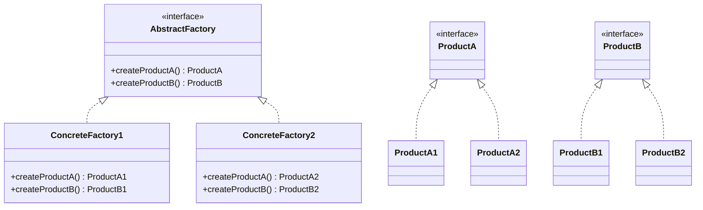
```mermaid
classDiagram
    class AbstractFactory {
        <<interface>>
        +createProductA() ProductA
        +createProductB() ProductB
    }
    class ConcreteFactory1 {
        +createProductA() ProductA1
        +createProductB() ProductB1
    }
    class ConcreteFactory2 {
        +createProductA() ProductA2
        +createProductB() ProductB2
    }
    class ProductA { <<interface>> }
    class ProductB { <<interface>> }
    class ProductA1
    class ProductA2
    class ProductB1
    class ProductB2
    AbstractFactory <|.. ConcreteFactory1
    AbstractFactory <|.. ConcreteFactory2
    ProductA <|.. ProductA1
    ProductA <|.. ProductA2
    ProductB <|.. ProductB1
    ProductB <|.. ProductB2
```

### 2. Builder

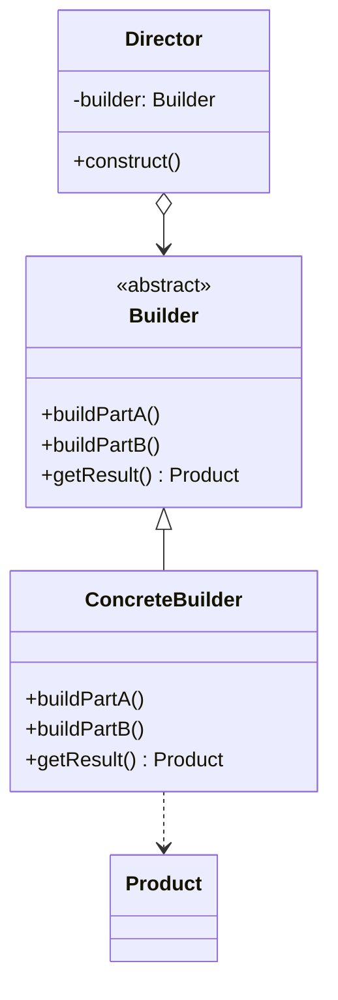
```mermaid
classDiagram
    class Director {
        -builder: Builder
        +construct()
    }
    class Builder {
        <<abstract>>
        +buildPartA()
        +buildPartB()
        +getResult() Product
    }
    class ConcreteBuilder {
        +buildPartA()
        +buildPartB()
        +getResult() Product
    }
    class Product
    Director o--> Builder
    Builder <|-- ConcreteBuilder
    ConcreteBuilder ..> Product
```

### 3. Factory Method

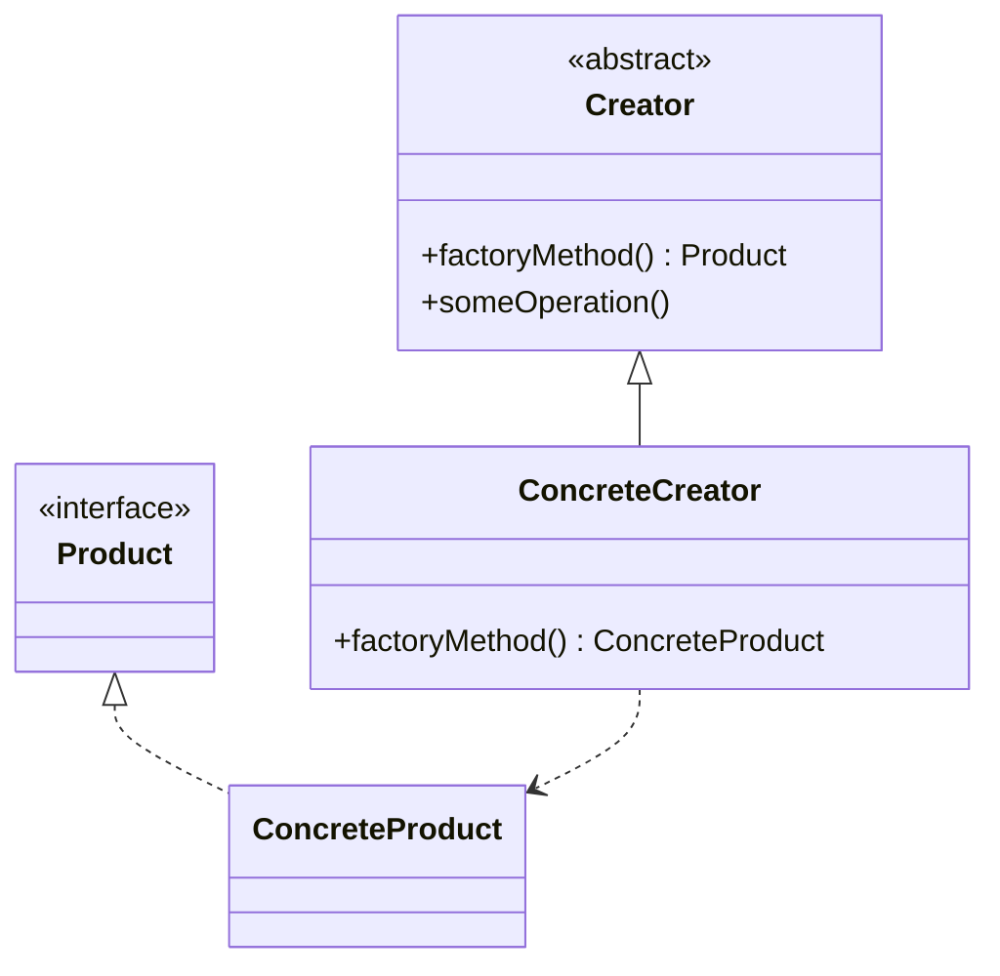
```mermaid
classDiagram
    class Creator {
        <<abstract>>
        +factoryMethod() Product
        +someOperation()
    }
    class ConcreteCreator {
        +factoryMethod() ConcreteProduct
    }
    class Product { <<interface>> }
    class ConcreteProduct
    Creator <|-- ConcreteCreator
    Product <|.. ConcreteProduct
    ConcreteCreator ..> ConcreteProduct
```

### 4. Prototype

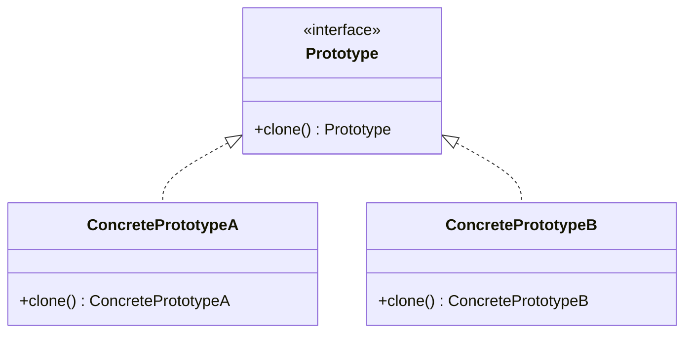
```mermaid
classDiagram
    class Prototype {
        <<interface>>
        +clone() Prototype
    }
    class ConcretePrototypeA {
        +clone() ConcretePrototypeA
    }
    class ConcretePrototypeB {
        +clone() ConcretePrototypeB
    }
    Prototype <|.. ConcretePrototypeA
    Prototype <|.. ConcretePrototypeB
```

### 5. Singleton

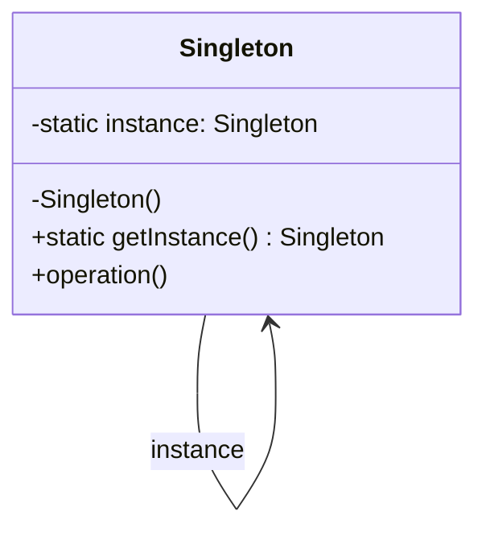
```mermaid
classDiagram
    class Singleton {
        -static instance: Singleton
        -Singleton()
        +static getInstance() Singleton
        +operation()
    }
    Singleton --> Singleton : instance
```

### 6. Adapter

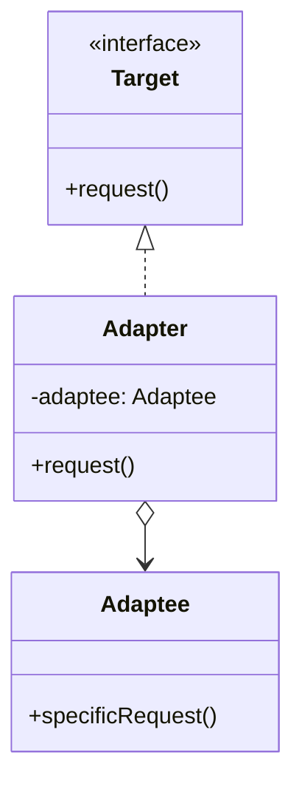
```mermaid
classDiagram
    class Target {
        <<interface>>
        +request()
    }
    class Adapter {
        -adaptee: Adaptee
        +request()
    }
    class Adaptee {
        +specificRequest()
    }
    Target <|.. Adapter
    Adapter o--> Adaptee
```

### 7. Bridge

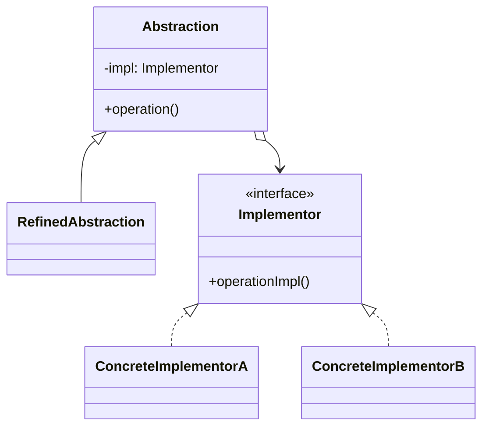
```mermaid
classDiagram
    class Abstraction {
        -impl: Implementor
        +operation()
    }
    class RefinedAbstraction
    class Implementor {
        <<interface>>
        +operationImpl()
    }
    class ConcreteImplementorA
    class ConcreteImplementorB
    Abstraction <|-- RefinedAbstraction
    Abstraction o--> Implementor
    Implementor <|.. ConcreteImplementorA
    Implementor <|.. ConcreteImplementorB
```

### 8. Composite

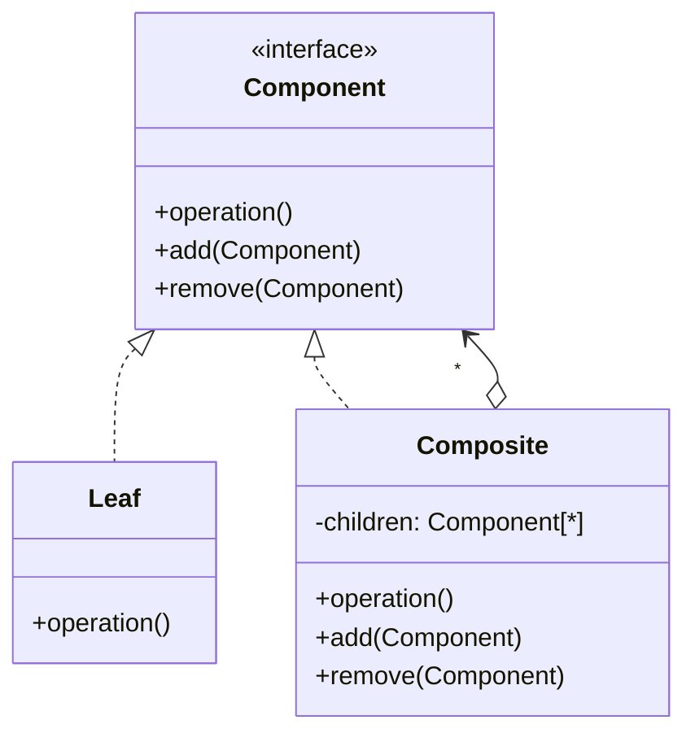
```mermaid
classDiagram
    class Component {
        <<interface>>
        +operation()
        +add(Component)
        +remove(Component)
    }
    class Leaf {
        +operation()
    }
    class Composite {
        -children: Component[*]
        +operation()
        +add(Component)
        +remove(Component)
    }
    Component <|.. Leaf
    Component <|.. Composite
    Composite o--> "*" Component
```

### 9. Decorator

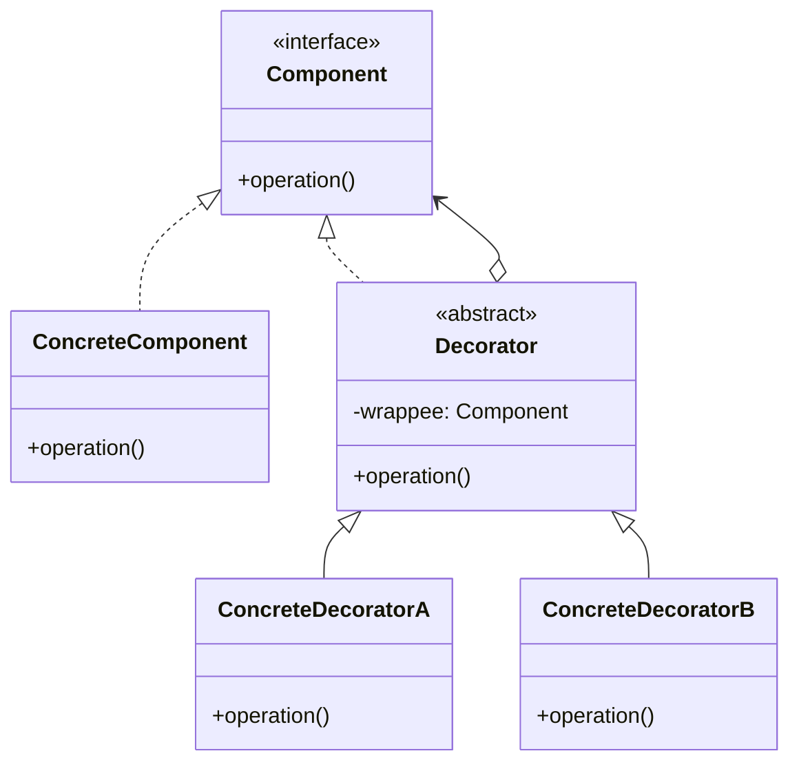
```mermaid
classDiagram
    class Component {
        <<interface>>
        +operation()
    }
    class ConcreteComponent {
        +operation()
    }
    class Decorator {
        <<abstract>>
        -wrappee: Component
        +operation()
    }
    class ConcreteDecoratorA {
        +operation()
    }
    class ConcreteDecoratorB {
        +operation()
    }
    Component <|.. ConcreteComponent
    Component <|.. Decorator
    Decorator <|-- ConcreteDecoratorA
    Decorator <|-- ConcreteDecoratorB
    Decorator o--> Component
```

### 10. Facade

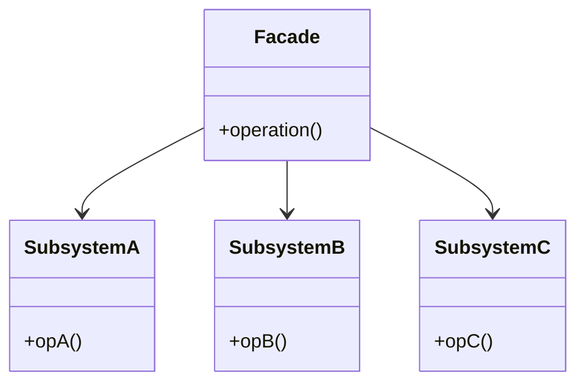
```mermaid
classDiagram
    class Facade {
        +operation()
    }
    class SubsystemA { +opA() }
    class SubsystemB { +opB() }
    class SubsystemC { +opC() }
    Facade --> SubsystemA
    Facade --> SubsystemB
    Facade --> SubsystemC
```

### 11. Flyweight

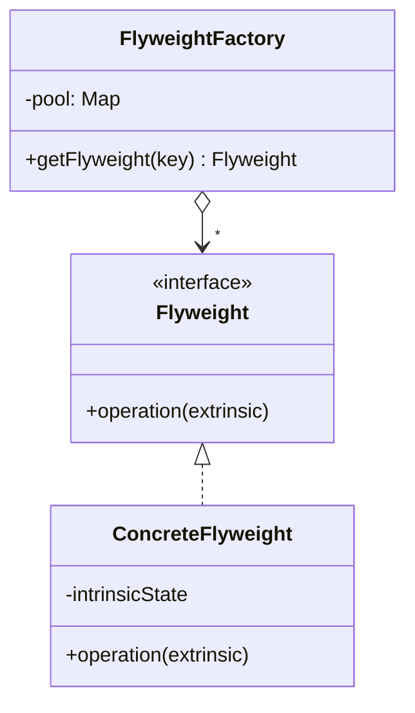
```mermaid
classDiagram
    class FlyweightFactory {
        -pool: Map
        +getFlyweight(key) Flyweight
    }
    class Flyweight {
        <<interface>>
        +operation(extrinsic)
    }
    class ConcreteFlyweight {
        -intrinsicState
        +operation(extrinsic)
    }
    FlyweightFactory o--> "*" Flyweight
    Flyweight <|.. ConcreteFlyweight
```

### 12. Proxy

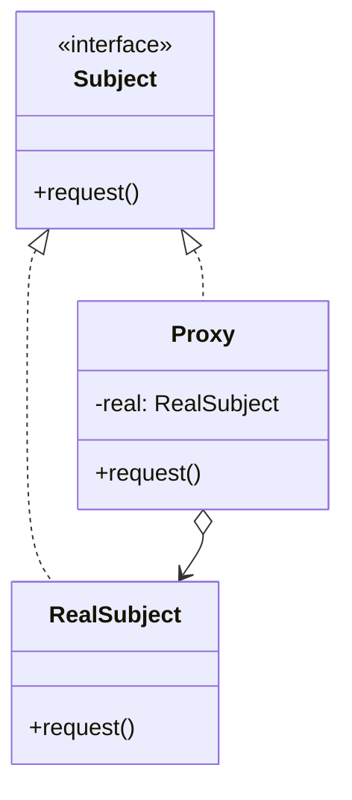
```mermaid
classDiagram
    class Subject {
        <<interface>>
        +request()
    }
    class RealSubject {
        +request()
    }
    class Proxy {
        -real: RealSubject
        +request()
    }
    Subject <|.. RealSubject
    Subject <|.. Proxy
    Proxy o--> RealSubject
```

### 13. Chain of Responsibility

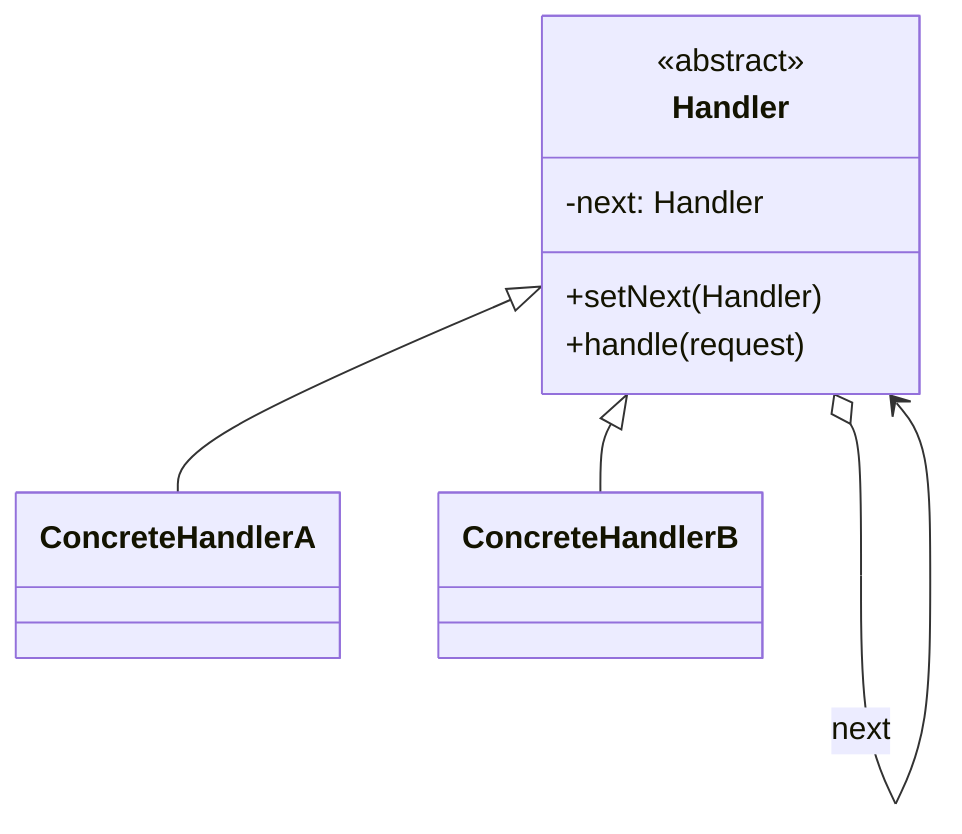
```mermaid
classDiagram
    class Handler {
        <<abstract>>
        -next: Handler
        +setNext(Handler)
        +handle(request)
    }
    class ConcreteHandlerA
    class ConcreteHandlerB
    Handler <|-- ConcreteHandlerA
    Handler <|-- ConcreteHandlerB
    Handler o--> Handler : next
```

### 14. Command

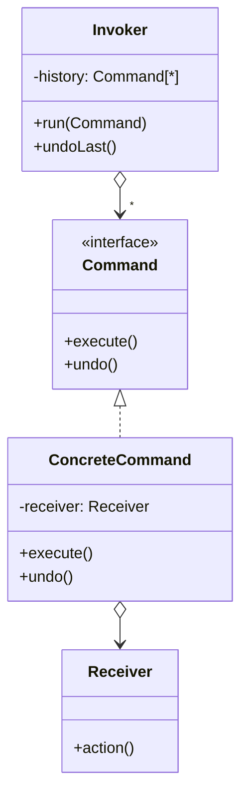
```mermaid
classDiagram
    class Command {
        <<interface>>
        +execute()
        +undo()
    }
    class ConcreteCommand {
        -receiver: Receiver
        +execute()
        +undo()
    }
    class Invoker {
        -history: Command[*]
        +run(Command)
        +undoLast()
    }
    class Receiver { +action() }
    Command <|.. ConcreteCommand
    Invoker o--> "*" Command
    ConcreteCommand o--> Receiver
```

### 15. Interpreter

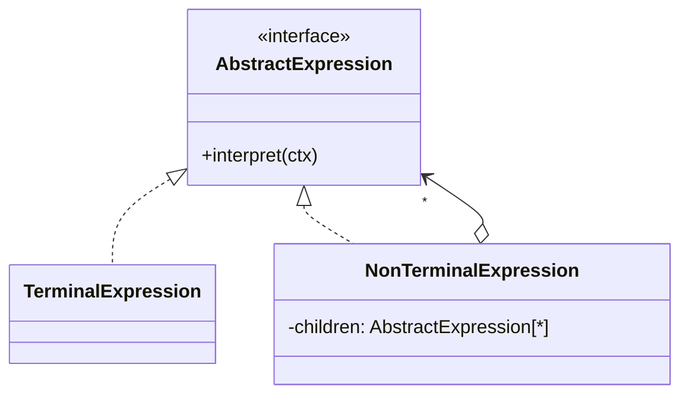
```mermaid
classDiagram
    class AbstractExpression {
        <<interface>>
        +interpret(ctx)
    }
    class TerminalExpression
    class NonTerminalExpression {
        -children: AbstractExpression[*]
    }
    AbstractExpression <|.. TerminalExpression
    AbstractExpression <|.. NonTerminalExpression
    NonTerminalExpression o--> "*" AbstractExpression
```

### 16. Iterator

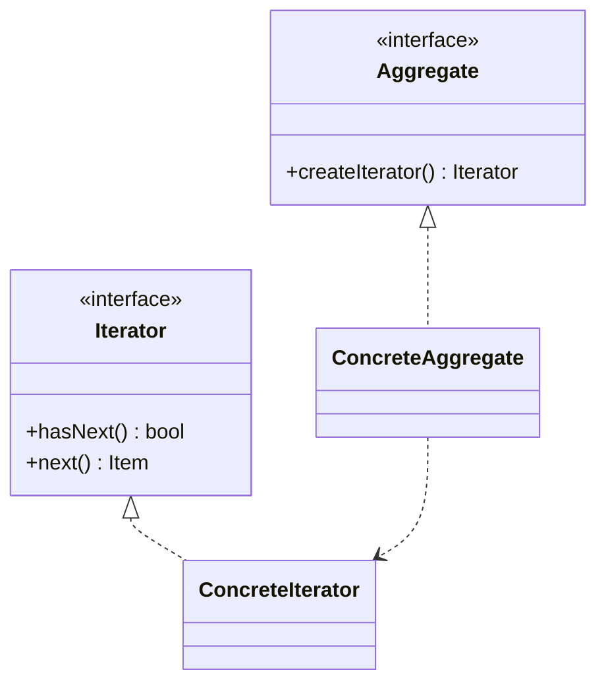
```mermaid
classDiagram
    class Iterator {
        <<interface>>
        +hasNext() bool
        +next() Item
    }
    class ConcreteIterator
    class Aggregate {
        <<interface>>
        +createIterator() Iterator
    }
    class ConcreteAggregate
    Iterator <|.. ConcreteIterator
    Aggregate <|.. ConcreteAggregate
    ConcreteAggregate ..> ConcreteIterator
```

### 17. Mediator

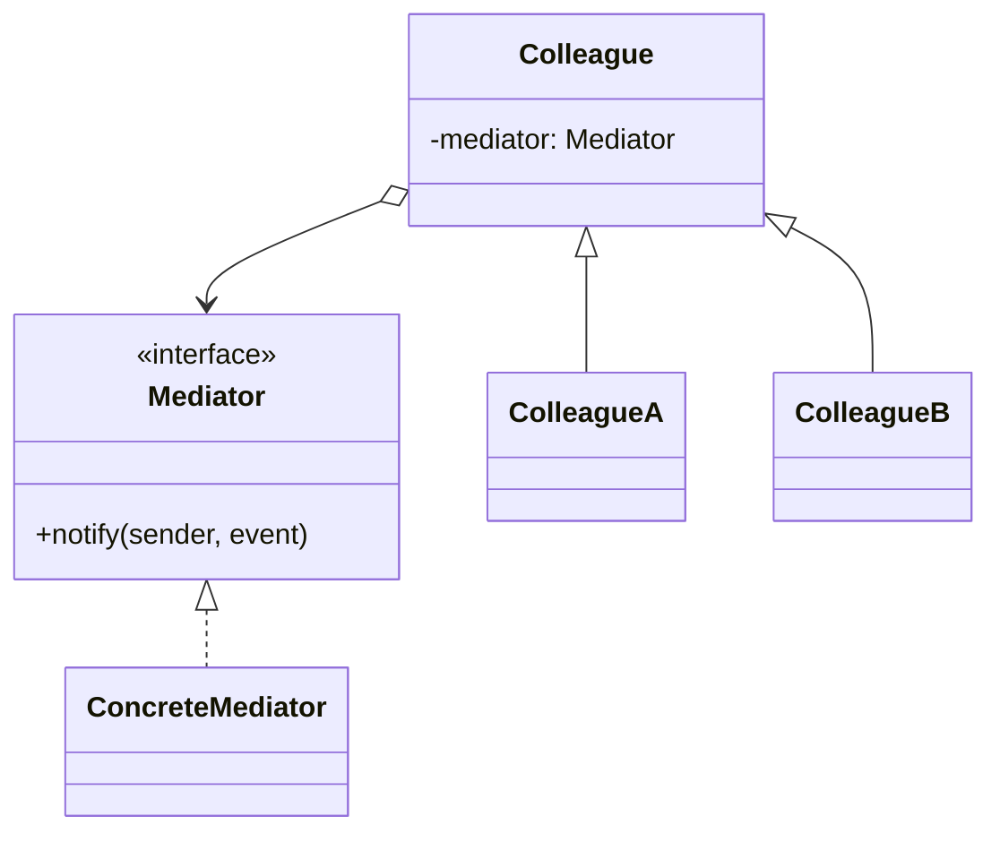
```mermaid
classDiagram
    class Mediator {
        <<interface>>
        +notify(sender, event)
    }
    class ConcreteMediator
    class Colleague {
        -mediator: Mediator
    }
    class ColleagueA
    class ColleagueB
    Mediator <|.. ConcreteMediator
    Colleague <|-- ColleagueA
    Colleague <|-- ColleagueB
    Colleague o--> Mediator
```

### 18. Memento

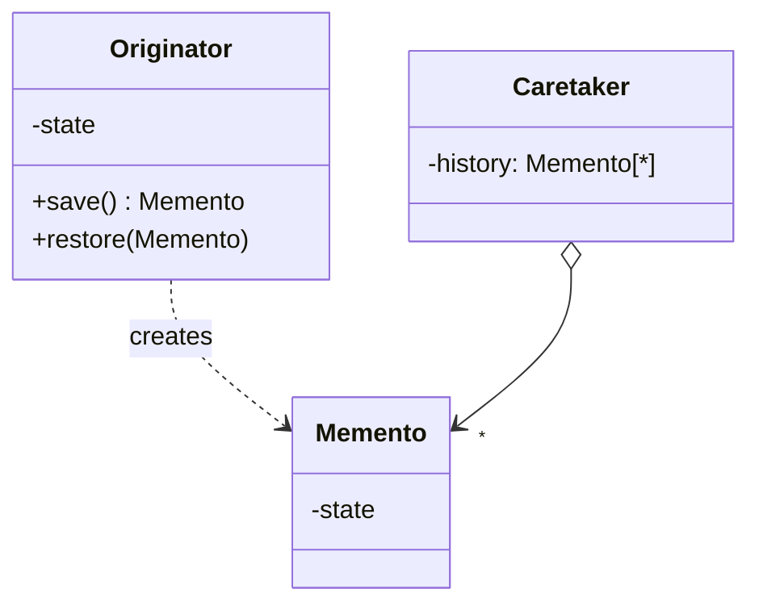
```mermaid
classDiagram
    class Originator {
        -state
        +save() Memento
        +restore(Memento)
    }
    class Memento {
        -state
    }
    class Caretaker {
        -history: Memento[*]
    }
    Originator ..> Memento : creates
    Caretaker o--> "*" Memento
```

### 19. Observer

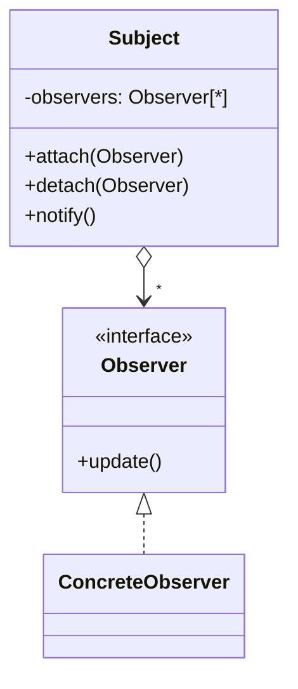
```mermaid
classDiagram
    class Subject {
        -observers: Observer[*]
        +attach(Observer)
        +detach(Observer)
        +notify()
    }
    class Observer {
        <<interface>>
        +update()
    }
    class ConcreteObserver
    Subject o--> "*" Observer
    Observer <|.. ConcreteObserver
```

### 20. State

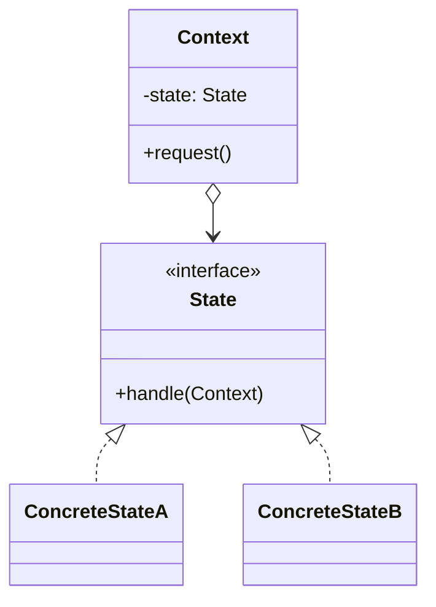
```mermaid
classDiagram
    class Context {
        -state: State
        +request()
    }
    class State {
        <<interface>>
        +handle(Context)
    }
    class ConcreteStateA
    class ConcreteStateB
    Context o--> State
    State <|.. ConcreteStateA
    State <|.. ConcreteStateB
```

### 21. Strategy

```mermaid
classDiagram
    class Context {
        -strategy: Strategy
        +execute()
    }
    class Strategy {
        <<interface>>
        +algorithm()
    }
    class ConcreteStrategyA
    class ConcreteStrategyB
    Context o--> Strategy
    Strategy <|.. ConcreteStrategyA
    Strategy <|.. ConcreteStrategyB
```

### 22. Template Method

```mermaid
classDiagram
    class AbstractClass {
        <<abstract>>
        +templateMethod()
        #stepOne()
        #stepTwo()
        #hook()
    }
    class ConcreteClass {
        #stepOne()
        #stepTwo()
    }
    AbstractClass <|-- ConcreteClass
```

### 23. Visitor

```mermaid
classDiagram
    class Visitor {
        <<interface>>
        +visitElementA(ElementA)
        +visitElementB(ElementB)
    }
    class ConcreteVisitor
    class Element {
        <<interface>>
        +accept(Visitor)
    }
    class ElementA
    class ElementB
    Visitor <|.. ConcreteVisitor
    Element <|.. ElementA
    Element <|.. ElementB
    ElementA ..> Visitor
    ElementB ..> Visitor
```

---

## Aplicación práctica — proyecto Sistema Académico Unisalle

Los 7 patrones requeridos por la práctica se aplican sobre un mini-proyecto
académico (estudiantes, cursos, matrículas, reportes, notificaciones).

| Patrón aplicado     | Clase principal                                       | Carpeta                                                                                                |
|---------------------|-------------------------------------------------------|--------------------------------------------------------------------------------------------------------|
| Builder             | `EstudianteBuilder`, `DirectorEstudiantes`            | [`SistemaAcademico/Patterns/Builder/`](SistemaAcademico/Patterns/Builder)                              |
| Factory Method      | `GeneradorReporte` + subclases                         | [`SistemaAcademico/Patterns/FactoryMethod/`](SistemaAcademico/Patterns/FactoryMethod)                  |
| Singleton           | `ConfiguracionSistema`                                 | [`SistemaAcademico/Patterns/Singleton/`](SistemaAcademico/Patterns/Singleton)                          |
| Decorator           | `NotificacionDecorator` + `EmailDecorator`, …          | [`SistemaAcademico/Patterns/Decorator/`](SistemaAcademico/Patterns/Decorator)                          |
| Strategy            | `IPoliticaCalificacion` + `PromedioSimple`, …          | [`SistemaAcademico/Patterns/Strategy/`](SistemaAcademico/Patterns/Strategy)                            |
| Facade              | `MatriculaFacade`                                      | [`SistemaAcademico/Patterns/Facade/`](SistemaAcademico/Patterns/Facade)                                |
| Command             | `IAccionMatricula` + `GestorMatriculas`                | [`SistemaAcademico/Patterns/Command/`](SistemaAcademico/Patterns/Command)                              |

Cada patrón cuenta con **2 pruebas unitarias xUnit** (14 en total) en
[`SistemaAcademico.Tests/`](SistemaAcademico.Tests). Ver
[`ManualPruebas.md`](ManualPruebas.md) para el paso a paso de ejecución.

## Bibliografía

- Gamma, E., Helm, R., Johnson, R., Vlissides, J. (1994). *Design Patterns:
  Elements of Reusable Object-Oriented Software*. Addison-Wesley.
- Freeman, E., Robson, E. (2020). *Head First Design Patterns* (2.ª ed.). O’Reilly.
- Microsoft Docs — *.NET Design Patterns*.
