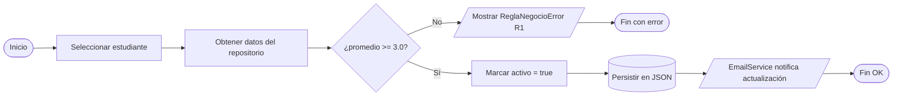
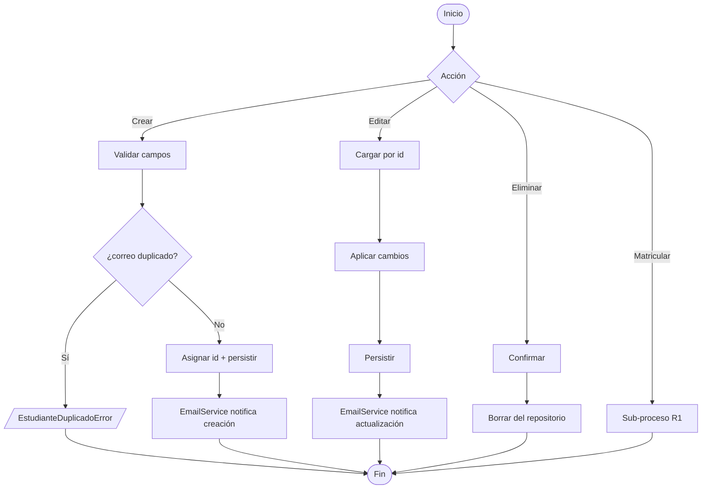
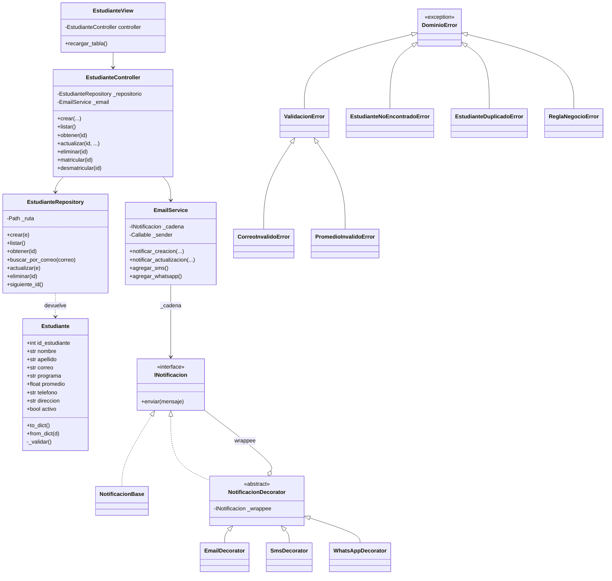
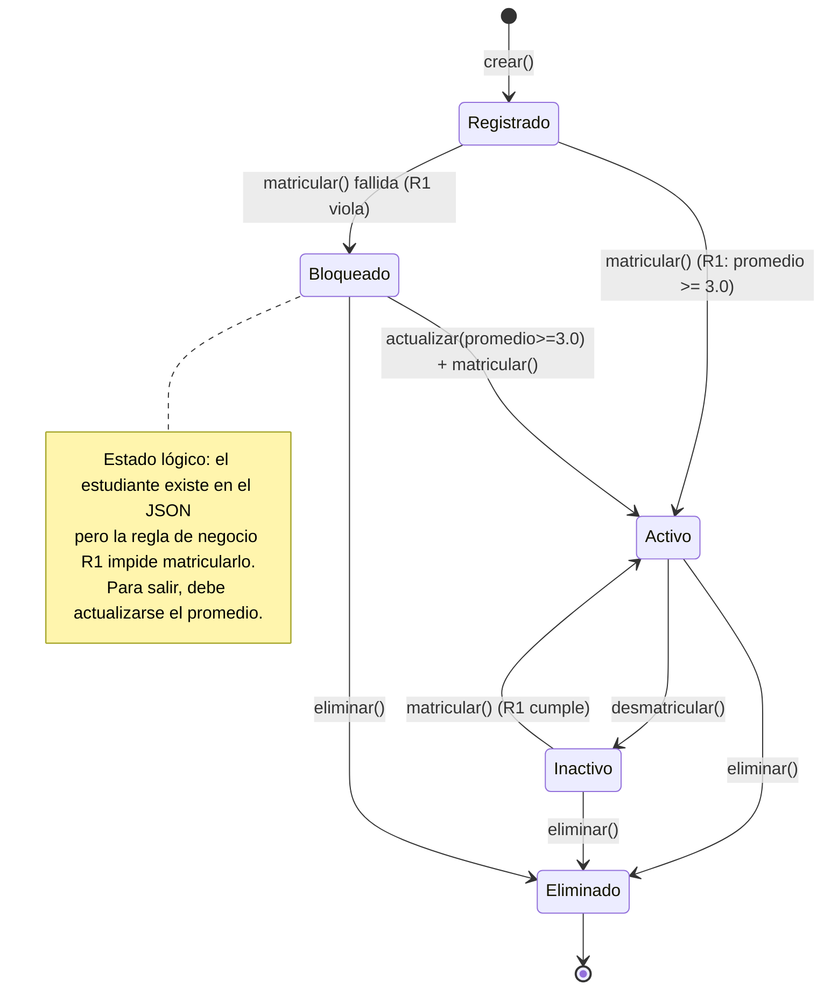

# Diagramas del proyecto

Los diagramas están escritos en **Mermaid**, que GitHub renderiza
automáticamente en la vista web del repositorio.

---

## 1. Mapa de procesos BPMN — *Matricular estudiante* (Regla R1)

El proceso de matrícula evidencia la regla de negocio **R1: el promedio
del estudiante debe ser mayor o igual a 3.0**. Si no se cumple, el
proceso termina con un evento de error y se notifica al usuario.

### Flujo CRUD general (sub-proceso *Gestionar Estudiante*)

---

## 2. Diagrama de clases

---

## 3. Diagrama de estados del Estudiante

